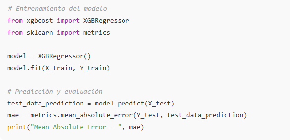
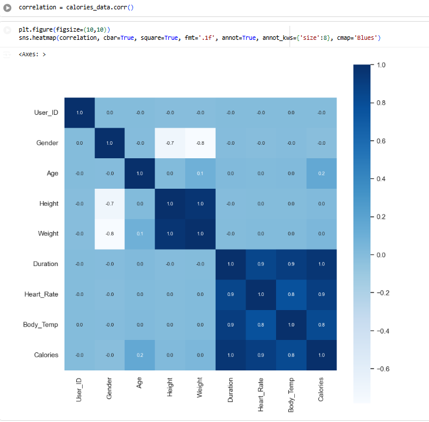

# Proyecto Predicción de Calorías Quemadas con XGBoost

Modelo de Machine Learning para estimar la cantidad de calorías quemadas durante el ejercicio físico, utilizando variables biométricas (edad, género, altura, peso, frecuencia cardíaca y duración).

---

## 🎯 Objetivo

- Predecir las calorías quemadas según características físicas y parámetros del ejercicio.

- Explorar relaciones entre variables como edad, peso, frecuencia cardíaca y gasto calórico.

- Entrenar un modelo de regresión basado en XGBoost para obtener una estimación precisa.

---

## 🛠️ Desarrollo

- Carga y unificación de datos:

Se importaron dos datasets (calories.csv y exercise.csv) y se combinaron por índice para generar una única tabla.

- Limpieza y exploración:

Eliminación de columnas irrelevantes (User_ID).

Conversión de variables categóricas (Gender) a formato numérico (0 = male, 1 = female).

Análisis exploratorio con histogramas (Age, Height, Weight) y distribución de género.

- Análisis de correlación:

Se generó un heatmap para observar la relación entre variables y su influencia sobre las calorías quemadas.

- Modelado:

Separación de variables predictoras (X) y variable objetivo (Y).

División del dataset en entrenamiento y test (80/20).

Entrenamiento del modelo XGBoost Regressor.

- Evaluación:

Predicción sobre el set de test y cálculo del Mean Absolute Error (MAE) como métrica principal de desempeño.

---

## 📸 Ejemplos (código del notebook)

Entrenamiento del modelo / Predicción y evaluación

Visualización de correlación

---

## 📊 Resultados

Mean Absolute Error (MAE): bajo, indicando buena capacidad predictiva.

El modelo logró una relación coherente entre variables fisiológicas y gasto energético.

Las variables peso, duración y frecuencia cardíaca resultaron las más influyentes.

---

## 🔧 Tecnologías utilizadas

Python

Pandas / NumPy (manipulación de datos)

Matplotlib / Seaborn (visualización)

Scikit-learn (entrenamiento y métricas)

XGBoost (modelo de regresión)
